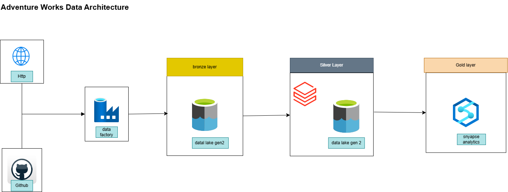

# 🏗️ Adventure Works DE Project | Azure Data Engineering Pipeline

This is an end-to-end Data Engineering project built using Microsoft Azure services. The pipeline ingests sales data from the **Adventure Works dataset (Kaggle)**, processes it using **PySpark in Azure Databricks**, stores it in a **data warehouse in Azure Synapse**, and visualizes insights using **Power BI**.

---

## 🔧 Tools & Technologies

- **Azure Data Factory** – Orchestration & Ingestion
- **Azure Databricks** – PySpark for data transformation
- **Azure Synapse Analytics** – Data warehouse & querying
- **Power BI** – Business Intelligence dashboards
- **Azure Blob Storage** – Raw data storage
- **Python, SQL, JSON**

---

## 📊 Architecture



---

## 📁 Folder Structure

```
Adventure_Works_DE_project/
🗄️ datafactory/
🗄️   pipelines/
🗄️   datasets/
🗄️   linkedservices/
🗄️ databricks/
🗄️   notebooks/
🗄️ synapse/
🗄️   sql/
🗄️ dataset/
🗄️   sample-data.csv
🗄️ images/
🗄️   architecture-diagram.png
🗄️   adf_pipline.png
README.md
```

---

## 🔄 End-to-End Pipeline Overview

### 1️⃣ Data Ingestion with Azure Data Factory

- Ingested raw CSV data from Azure Blob Storage.
- Created linked services and datasets to define the source and sink.

### 2️⃣ Data Transformation in Azure Databricks

- Read raw data using PySpark.
- Cleaned null values, cast data types, derived fields (e.g., total sales, customer region).
- Exported the processed data as Delta or Parquet to curated layer.

### 3️⃣ Data Warehousing in Azure Synapse

- Created fact and dimension tables from processed data.
- Used SQL scripts for table creation and querying.
- Exposed curated data to BI layer via SQL views.

---

## 📊 Dataset Source

[**Adventure Works Dataset**](https://www.kaggle.com/datasets/ukveteran/adventure-works)

- Sales, customers, products, territories
- Downloaded manually and uploaded to Azure Blob Storage

---

## 🔐 Note on Secrets

> No real credentials or keys are stored in this repository. All sensitive data (client secrets, keys, connection strings) have been removed or replaced with placeholders.

---

## 📌 How to Reproduce (Locally or in Cloud)

> Note: This project is cloud-native and depends on Azure services.

1. Clone the repo
2. Upload your own copy of the dataset to Azure Storage
3. Recreate ADF pipelines using provided JSON
4. Run PySpark scripts in Databricks
5. Use Synapse scripts to create tables
6. Connect Power BI and import the dashboard

---

## 📷 Screenshots

| ADF Pipeline | Databricks Transformation |
| ------------ | ------------------------- | 
|              |                           |           

---

## 🤝 Credits

- Dataset: [Adventure Works – Kaggle](https://www.kaggle.com/datasets/ukveteran/adventure-works)
- Icons: [Azure Architecture Icons](https://learn.microsoft.com/en-us/azure/architecture/icons/)

---


---

## 📮 Contact

If you'd like to collaborate, improve this project, or connect about data roles in Australia 🇦🇺, feel free to reach out:

**LinkedIn**: [@ishan--gautam](https://www.linkedin.com/in/ishan--gautam/)

